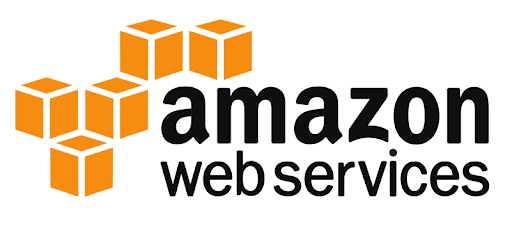

# AWS services

[![Python version][python_version_img]][python_repos_url][![Serverless version][serverless_version_img]][serverless_repos_url] [![Wiki][repo_wiki_img]][repo_wiki_url]

<!-- python -->
[python_version_img]: https://img.shields.io/badge/Python-3.8+-00ADD8?style=for-the-badge&lopython=python
[python_repos_url]: https://www.python.org/downloads/

<!-- Serverless -->
[serverless_version_img]: https://img.shields.io/badge/Serverless-3.3-f55442?style=for-the-badge&lopython=python
[serverless_repos_url]: https://www.npmjs.com/package/serverless

<!-- Repository -->
[repo_wiki_url]: https://github.com/Adrien-Crapart/aws-services
[repo_wiki_img]: https://img.shields.io/badge/docs-wiki_page-blue?style=for-the-badge&python=none

Welcome to the AWS services. You can deploy lambdas and use files objects on S3 buckets here.

## :computer: To test locally

1. Create your own environment variable file with `.env` from `.env.example` and replace it

```bash
LOCALSTACK_AUTH_TOKEN="YOUR_TOKEN"
```

*Any account ? Please subscribe a new account for hobbies only on: <https://www.localstack.cloud/>*

:zap: 2. To run make the AWS lambda, execute this command

```bash
make start
```

:dizzy: 3. To refresh after changes, please follow this command instead

```bash
make deploy
```

> :bulb: The library ruff is used for validation code and standardize
*More documentation about serverless :* <https://www.serverless.com/plugins/serverless-localstack>

## :top:To develop new features

1. Please reuse the actual "services" folder and add new file with your functions.

2. Then add inside "lambda_handler" function in `handler.py` file like this example and ajust configuration if necessary

```bash
undefined for the moment
```

3. To see the logs of lambda, connect on [CloudWatch] with your IAM account

> **Property of lambda to know**
>
> * Be aware that without a lambda warmer, it can take up to 5 seconds to invoke the lambda for the first time
>
> * **Timeout** : 3s by default at 15minutes
>
> * **MemorySize** : 128 MB by default at 10,240 MB
>
> * **Warm** : non-VPC time => 5minutes, VPC => 15minutes
>
> To know the cost of your lambda : <https://calculator.aws/#/createCalculator/Lambda>

[CloudWatch]: ""

## :rocket: How to use the AWS API lambda

This is an exemple of url after the deployed service

```bash
http://[lambda-url-generated-id].lambda-url.eu-west-3.localhost.localstack.cloud:4566/?
```

## :open_file_folder: Use S3 bucket to store files

**Why Minio instead S3 on localstack ?**

Because Minio is less complicated to use flat files, you can access on interface to store or download the folders or files.

> Please visit this url to get access : <http://localhost:9001>

## :construction_worker: Authors

* [@AdrienCrapart](https://www.github.com/Adrien-Crapart)
